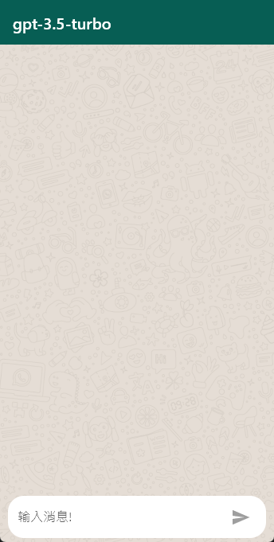
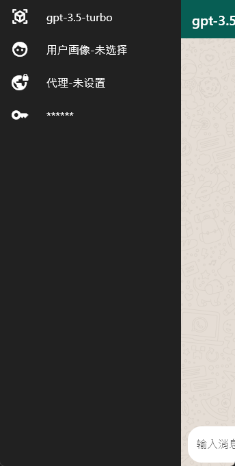

# bot_chat

基于ChatGPT API 封装UI的聊天界面    

## 功能  

 1. 通过ChatGPT API获取上下文聊天内容
 2. 配置聊天画像
 3. 设置自己OpenAI api key
 4. 设置代理(web 不能设置代理)  

## 支持  

1. Windows
2. Android
3. iOS
4. Web  

## 使用
> ui为手机样式,可能会适配多端

## todo 
[待办事项](https://turquoise-birch-d43.notion.site/for-Bot-Chat-2a7a2dc866fb43bd8d7772e7195cc227)

 

